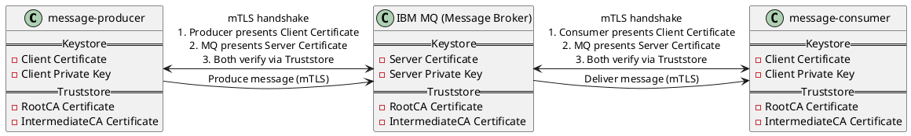

# IBM MQ usage with Spring Boot using mTLS

## Overview

This repository contains a sample Java Spring Boot application that connects to IBM MQ using mTLS.
The application demonstrates how to configure mTLS for secure communication with the IBM MQ server.



IBM MQ is used a message broker to facilitate communication between two Spring Boot applications: a message producer and
a message consumer.

The provided example is simplified, it uses only one queue without any topics—this is to focus on the mTLS
configuration.

## Certificates and Private Keys

mTLS usage requires certificates and private keys for both the client (Spring Boot application) and the server (IBM MQ).

RootCA and IntermediateCA certificates are used to establish a chain of trust. The server and clients certificates are
signed by the IntermediateCA, which in turn is signed by the RootCA. This ensures that both parties can verify each
other's authenticity.

IBM MQ Server includes:

- Keystore
    - Server Certificate
    - Server Private Key
- Truststore
    - RootCA Certificate
    - IntermediateCA Certificate

Both Spring Boot Clients include:

- Keystore
    - Client Certificate
    - Client Private Key
- Truststore
    - RootCA Certificate
    - IntermediateCA Certificate

When mTLS connection is established, the client presents its certificate to the server, and the server presents its
certificate to the client. Both parties verify the received certificates against their respective trust stores to ensure
that they are communicating with a trusted entity.

## Generating Certificates and Private Keys

You can generate the necessary certificates and private keys by running
the [run-generate-dummy-certificates.sh](ibm-mq/run-generate-dummy-certificates.sh) script.

## Running the project

Run the following command in the root directory:

```shell
docker compose up
```

## Producing the message

To produce a message, you need to execute REST API endpoints `/api/v1/produce-message`. This endpoint is exposed by
`message-producer` service. It will produce a message to the IBM MQ queue, which will be consumed by the
`message-consumer` service. Execute the below command:

```shell
curl localhost:8082/api/v1/produce-message
```

After execution of the above command, you should see the below message in the logs of the `message-consumer` service:

```text
message-consumer-1  | Received message: Hello World!
```

## References

- [Securing Spring Boot Applications With SSL](https://spring.io/blog/2023/06/07/securing-spring-boot-applications-with-ssl)
- [Spring Boot Reference Documentation - SSL](https://docs.spring.io/spring-boot/reference/features/ssl.html)
- [Using CA-signed certificates for mutual authentication of a client and queue manager](https://www.ibm.com/docs/en/ibm-mq/9.4.x?topic=ccqms-using-ca-signed-certificates-mutual-authentication-client-queue-manager)

## Author

Dominik Cebula

- https://dominikcebula.com/
- https://blog.dominikcebula.com/
- https://www.udemy.com/user/dominik-cebula/
